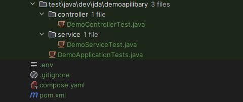
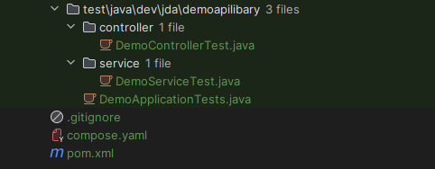

## Removing files from Git history
Some files should **never** be uploaded to Repo (API keys, `.env`, secrets, large binaries, etc.).  
This guide shows several safe ways to remove files from your Git history.

### Example Repo:
In the entire history all .env files were removed.


 


 

## 1. Create a backup branch
Always create a backup before rewriting history.

```bash
git checkout -b <backup-branch-name>
git push -u origin <backup-branch-name>
```

## 2. Start an interactive rebase from the root

```bash
git rebase -i --root
```

Git will open a list of all commits:

```
pick a1b2c3 first commit
pick d4e5f6 env files added
pick 123abc config changes
...
```

### Available actions
- `pick` → keep the commit
- `edit` → modify the commit content
- `reword` → change only the commit message
- `squash` → combine commits
- delete a commit → remove the entire line


## 3. Save and close the editor
If you're using Vim:

- Press `Esc`
- Type `:wq`
- Press `Enter`


## 🔥 Example: editing a commit during rebase
If you changed `pick` → `edit`, run:

```bash
git commit --amend
git rebase --continue
```

Repeat this for every commit Git stops at.


## ⚠️ Important: force‑push after rewriting history
After the rebase is complete:

```bash
git push --force-with-lease
```

`--force-with-lease` is safer than `--force` because it prevents overwriting work you don’t have locally.
